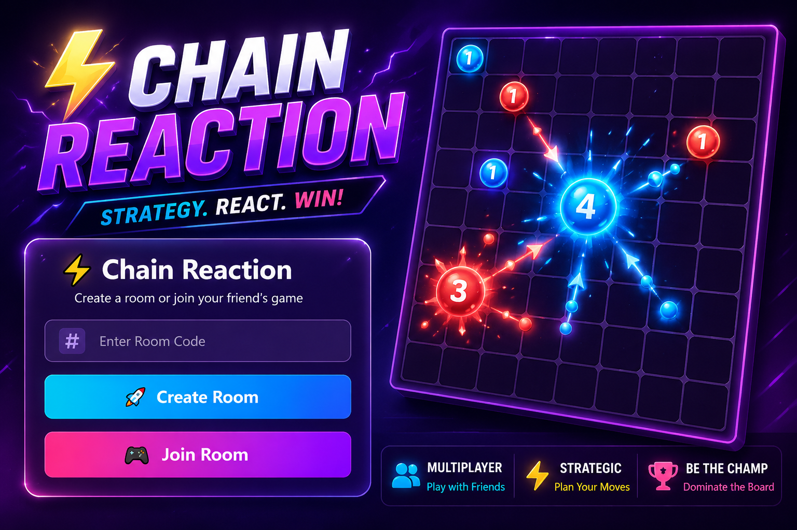

# ⚡ Chain Reaction Multiplayer

A real-time multiplayer **Chain Reaction** game built using **React, TypeScript, Node.js, Express, Socket.IO, and Tailwind CSS**. Players can create or join a room and compete in a strategic chain reaction battle.



---

## 🎮 Features

- 🎲 Real-time multiplayer gameplay
- 🏠 Create and join private rooms
- ⚡ Chain reaction explosion mechanics
- 🔄 Live board synchronization using Socket.IO
- 👥 Turn-based gameplay
- 🏆 Winner detection
- 🎨 Modern gaming UI with Tailwind CSS
- 📱 Responsive design

---

## 🛠 Tech Stack

### Frontend

- React
- TypeScript
- Tailwind CSS
- Socket.IO Client
- Vite

### Backend

- Node.js
- Express.js
- Socket.IO

---

## 📂 Project Structure

```
Chain-Reaction/
│
├── frontend/
│   ├── src/
│   │   ├── Components/
│   │   ├── pages/
│   │   ├── socket.ts
│   │   └── App.tsx
│   │
│   └── package.json
│
├── backend/
│   ├── server.js
│   ├── package.json
│   └── ...
│
└── README.md
```

---

# 🚀 Getting Started

## 1. Clone Repository

```bash
git clone https://github.com/your-username/Chain-Reaction.git

cd Chain-Reaction
```

---

## 2. Install Dependencies

### Frontend

```bash
cd frontend

npm install
```

### Backend

```bash
cd backend

npm install
```

---

## 3. Run Development Server

### Backend

```bash
npm run dev
```

Server runs on

```
http://localhost:8787
```

---

### Frontend

```bash
npm run dev
```

Runs on

```
http://localhost:5173
```

---

## 📦 Production Build

Frontend

```bash
npm run build
```

Preview

```bash
npm run preview
```

---

## 🎲 Gameplay

### Create Room

1. Enter a room code.
2. Click **Create Room**.
3. Share the room code with your friend.

### Join Room

1. Enter the room code.
2. Click **Join Room**.
3. Game starts when both players join.

---

## ⚡ Game Rules

- Players take turns placing atoms.
- Every cell has a critical mass.
- Corners explode with **2 atoms**.
- Edge cells explode with **3 atoms**.
- Center cells explode with **4 atoms**.
- Explosions spread atoms to neighboring cells.
- Neighboring cells become owned by the exploding player.
- Chain reactions continue until the board stabilizes.
- The last remaining player wins.

---

## 📸 Screenshots

### Lobby

Add your lobby screenshot here.

```
screenshots/lobby.png
```

### Gameplay

Add your gameplay screenshot here.

```
screenshots/gameplay.png
```

### Winner Screen

Add your winner popup screenshot here.

```
screenshots/winner.png
```

---

## 🔌 Socket Events

### Client → Server

| Event | Description |
|--------|-------------|
| createRoom | Create a room |
| joinRoom | Join existing room |
| send | Send player move |

---

### Server → Client

| Event | Description |
|--------|-------------|
| startGame | Start match |
| playerAssigned | Assign player number |
| boardUpdate | Sync board |
| turnChange | Update turn |
| roomFull | Room is full |
| invalid | Invalid move |

---

## 🌟 Future Improvements

- 🤖 AI opponent
- 🎵 Sound effects
- ✨ Blast animations
- 🏅 Leaderboard
- 👀 Spectator mode
- 🔁 Rematch option
- 💬 In-game chat
- 📱 Mobile optimization

---

## 👨‍💻 Author

**Vishal Yadav**

GitHub: https://github.com/your-username

LinkedIn: https://linkedin.com/in/your-profile

---

## 📄 License

This project is licensed under the MIT License.

---

⭐ If you like this project, don't forget to star the repository!
